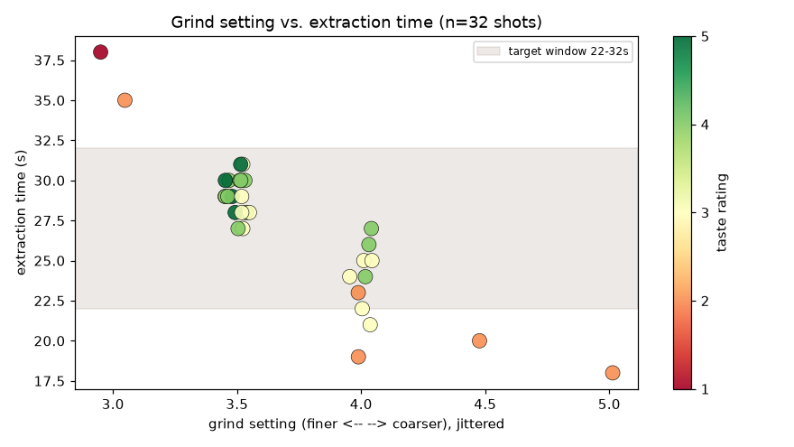

# Espresso Log

A small SQLite database for tracking espresso shots on a DeLonghi La
Specialista Arte, and for answering the question every home barista argues
about: which settings actually produce a good cup?

Every shot is logged with its dose, grind setting, extraction time, yield and
a taste rating. The analysis is plain SQL — the interesting part of this
project is the data model and the queries, not the interface.

## Data model

Two tables. One bag of coffee has many shots.

```
beans                          shots
-----                          -----
id          INTEGER PK  <----  bean_id           INTEGER FK
name        TEXT                shot_date         DATE
roaster     TEXT                dose_g            REAL   > 0
roast_date  DATE                grind_setting     REAL   > 0
notes       TEXT                extraction_time_s INTEGER > 0
                                yield_g           REAL   >= 0
                                water_temp_c      REAL   92 | 94 | 96
                                taste_rating      INTEGER 1-5
                                taste_notes       TEXT   one of 8 categories
                                machine           TEXT
```

Two columns take values from a fixed list rather than free input:

- **`water_temp_c`** — the machine offers three settings: `92.0` (Low),
  `94.0` (Middle), `96.0` (High).
- **`taste_notes`** — `Chocolatey & Cocoa`, `Nutty & Toasty`, `Fruity-Sweet`,
  `Citrusy & Zesty`, `Floral & Tea-like`, `Spicy & Earthy`,
  `Sweet & Caramelized`, `Balanced & Mild`.

Both stay optional: a `CHECK` rejects a row only when its expression is
false, and `NULL IN (...)` is neither, so an empty field still passes.

Four decisions worth pointing out:

- **Brew ratio is never stored.** It is `yield_g / dose_g`, so storing it
  would allow it to contradict the columns it derives from. It is computed
  in queries and exposed through the view `v_shot_details`, together with
  the bean's rest time in days.
- **`yield_g >= 0`, not `> 0`.** A choked shot that channels and delivers
  nothing is a real result worth recording, not an input error.
- **`grind_setting` is a number, not text.** That is what makes
  "which grinder setting hits the target extraction window?" answerable.
- **`taste_notes` is a controlled vocabulary, not free text.** "Caramel, red
  apple, long finish" reads nicely but cannot be grouped, so
  "how do chocolatey beans score?" would stay unanswerable. The eight
  categories cost some descriptive detail and buy `GROUP BY`.

Value ranges are enforced by `CHECK` constraints in the database itself, so
invalid rows are rejected no matter which client writes them.

## Setup

```bash
python3 -m venv .venv
source .venv/bin/activate
pip install -r requirements.txt
```

Create the database and load the sample data:

```bash
python3 src/log_shot.py init
sqlite3 data/espresso.db < seed.sql
```

The real database is not part of this repository (see `.gitignore`) — it is
personal data and a binary file. `schema.sql` and `seed.sql` rebuild an
equivalent one in two commands.

## Logging shots

```bash
python3 src/log_shot.py add-bean          # asks for the values it needs
python3 src/log_shot.py add-shot          # same, and lists the beans first
python3 src/log_shot.py list-shots --limit 5
```

Every field can also be passed as a flag, which makes the CLI scriptable:

```bash
python3 src/log_shot.py add-shot --bean-id 3 --dose-g 18 --grind 3.5 \
    --time-s 29 --yield-g 36 --temp-c 94 --rating 5 --notes 7
```

`--temp-c` takes one of the three machine settings, and `--notes` a number
from the category list — `7` is `Sweet & Caramelized`. Both are listed in
`add-shot --help`, and interactive mode offers them as numbered menus, so
nobody has to remember the exact spelling.

```
Added shot #33
Brew ratio: 1:2.00
```

Invalid values never reach the table:

```
$ python3 src/log_shot.py add-shot --bean-id 1 --dose-g 18 --rating 9
Rejected by the database: CHECK constraint failed: taste_rating BETWEEN 1 AND 5

$ python3 src/log_shot.py add-shot --bean-id 999 --dose-g 18 --rating 3
Rejected by the database: FOREIGN KEY constraint failed
```

## Quick entry (mobile-friendly)

Typing at a terminal is the least likely thing to happen right after pulling
a shot. [`app.py`](app.py) is a small [Streamlit](https://streamlit.io) page
for exactly that moment: bean, dose and grind setting come pre-filled from
the last shot, so usually only the extraction time and the rating need
touching.

Locally:

```bash
streamlit run app.py
```

To reach it from a phone, the app has to listen on the network rather than
on localhost only. First find the Mac's address on the Wi-Fi interface:

```bash
ipconfig getifaddr en0
```

Then start it with that in mind:

```bash
streamlit run app.py --server.address 0.0.0.0
```

Streamlit prints a `Network URL` — open it on the phone, for example
`http://192.168.2.51:8501`.

Three things worth knowing:

- Phone and Mac must be on the **same** Wi-Fi.
- macOS asks once whether Python may accept incoming connections. Without
  that permission the page stays unreachable from the phone.
- **The app has no login.** Anyone on the same network who opens the address
  can add shots. Fine for a home network, not something to expose further.

If `ipconfig getifaddr en0` prints nothing, Wi-Fi is on a different
interface; `route get default | grep interface` names the active one.

## Analysis

All queries live in [`queries.sql`](queries.sql), commented one by one. Run
the whole file:

```bash
sqlite3 -header -column data/espresso.db < queries.sql
```

### Which bean scored best?

`GROUP BY` with `HAVING`, so bags with too few shots to judge are excluded.

```
bean                       roaster         shots  avg_rating  avg_time_s  avg_brew_ratio
-------------------------  --------------  -----  ----------  ----------  --------------
Colombia Huila             Roesterei Vier  9      4.33        28.0        2.02
Brazil Fazenda Santa Ines  The Barn        8      3.25        29.0        1.72
Ethiopia Sidamo            Roesterei Vier  8      3.0         25.0        2.03
India Monsooned Malabar    Elbgold         7      2.71        27.0        2.0
```

### Does extraction time predict quality?

`CASE` turns a continuous value into comparable buckets.

```
extraction_band      shots  avg_rating  avg_brew_ratio
-------------------  -----  ----------  --------------
a: under 22s (fast)  4      2.25        2.18
b: 22-32s (target)   26     3.69        1.99
c: over 32s (slow)   2      1.5         0.92
```

Shots inside the 22–32 second window average a full rating point above the
fast ones — and the fast shots also run thin, at a brew ratio well above 1:2.

### Which grinder setting hits the target window?

Only answerable because the grind setting is stored as a number.

```
grind_setting  shots  avg_time_s  avg_brew_ratio  avg_rating
-------------  -----  ----------  --------------  ----------
3.0            2      36.5        0.92            1.5
3.5            18     29.1        1.97            3.89
4.0            10     23.6        2.05            3.1
4.5            1      20.0        2.11            2.0
5.0            1      18.0        2.33            2.0
```

Setting 3.5 lands in the middle of the target window and rates highest.



Every shot as one point, coloured by rating. Finer than 3.5 runs long and
scores badly, coarser than 4.0 runs short and scores badly — 3.5 is the only
setting that sits inside the window across the board. The chart is produced
by the last cell of the notebook.

The remaining queries cover the brew ratio per shot, the full parameter set
of every top-rated shot, the effect of bean rest time (a `julianday()`
difference), and a rating trend over time using a window function.

## Notebook

[`notebooks/analyse.ipynb`](notebooks/analyse.ipynb) loads the same data with
pandas and plots four of these questions, including a rolling average that
smooths out single good or bad shots.

```bash
jupyter lab notebooks/analyse.ipynb
```

## Testing

```bash
pytest
```

64 tests covering three layers:

- **`tests/test_schema.py`** — every `CHECK` constraint and the foreign key,
  written straight to SQLite. Each rule is tested from both sides: a value
  that must be accepted and one that must be rejected. `yield_g = 0` has its
  own test, because that is a deliberate design decision rather than an
  oversight. The two controlled vocabularies are covered value by value —
  every allowed water temperature and taste category is inserted, near
  misses like `chocolatey & cocoa` are rejected, and `NULL` is accepted for
  both, since the columns stay optional.
- **`tests/test_db.py`** — `init_db()` builds the tables, indexes and view
  and is safe to run twice; `get_connection()` returns rows addressable by
  column name and has foreign key enforcement switched on.
- **`tests/test_cli.py`** — the CLI driven as a real subprocess, so argument
  parsing, exit codes and printed output are covered too, including that
  `--notes 7` is stored as `Sweet & Caramelized` rather than as `7`.

Each test runs against its own temporary database via the `ESPRESSO_DB`
environment variable, so `data/espresso.db` is never touched.

The vocabulary tests parametrise over the constants in `src/db.py` rather
than over a second hand-written list. `schema.sql` remains the authority: if
the Python lists and the schema ever disagree, the offending value is
rejected by the database and exactly one test fails, named after the value
that drifted. That is the point of the copy in Python being testable at all.

## Development Process

I built this project with [Claude Code](https://claude.com/claude-code)
as an implementation assistant. The design decisions, the data model
(tables, constraints, the `v_shot_details` view), the SQL query set,
and the git workflow (branch and commit structure) were mine, reviewed
and adjusted before each implementation step. Claude Code wrote the
code under that direction and flagged trade-offs (e.g. `REAL` vs
`INTEGER` for `grind_setting`) for me to decide.

This project is part of a portfolio built to practice SQL and data
modeling. See the commit history for the incremental build order.

## Possible next steps

- A `pull` command that repeats the parameters of a previous shot
- Tracking water hardness and basket size
- Exporting a monthly summary

## License

MIT — see [LICENSE](LICENSE).
